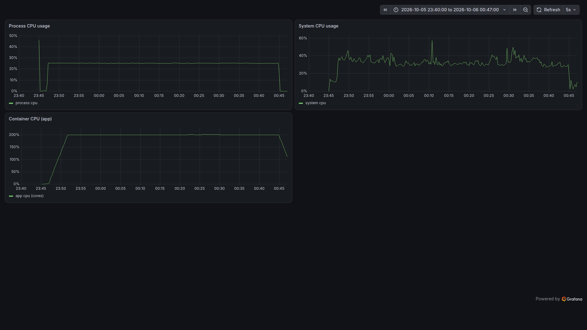

# JVM Incident Investigation: Part 1 — CPU Profiling

CPU в Grafana ушёл с **0.00017** на плато **~0.17** за пару секунд. Что дальше — сразу запускать async-profiler? По алгоритму из Part 0 — нет: сначала симптом, потом вопрос, потом инструмент.

У нас есть демо-приложение с «красной кнопкой»: ручка, которая включает busy-loop и отправляет CPU в потолок. Пройдём весь путь от симптома до первопричины, с реальными командами и реальными метриками.

## Симптом: CPU улетел

Включаем проблему одной командой:

```bash
scripts/incidents.sh start cpu
```

Ответ:

```json
{ "type": "cpu", "status": "active", "description": "проблема активирована" }
```

Открываем Grafana, дашборд **Part 1 — CPU Profiling**.

До запуска `process_cpu_usage` был практически нулевым — **0.00017**. Через несколько секунд после `start` он подскочил до **0.17**.

Почему не до 1.0? Потому что `process_cpu_usage` — это доля *всей* машины, а не одного ядра: на 8-ядерной машине значение 0.17 соответствует примерно 0.17 × 8 ≈ 1.4 занятого ядра. Два busy-loop потока в пике дают около 2/8 ≈ 0.25; 0.17 — это скользящая оценка, а не мгновенный максимум. (Это верно при отсутствии cgroup CPU-лимитов: если контейнеру выделено, скажем, 1 ядро, картина будет другой.) Важен не абсолют, а форма: метрика ушла с нуля и держится на плато.

Заодно смотрим на `system_cpu_usage`. Тонкость: наш процесс сам вносит вклад в system-загрузку (GC, I/O, JIT), поэтому небольшой рост `system` — норма, а не признак соседа. Диагностический признак — соотношение: если `process` вырос на порядок, а `system` почти не сдвинулся, горит наш процесс; если обе метрики растут пропорционально — загружена вся машина, и стоит искать шумного соседа. У нас резко растёт `process` при почти плоском `system` — это точно мы. Симптом подтверждён.

## Дашборд: Part 1 — CPU Profiling

Прежде чем идти дальше — зафиксируем карту наблюдения. Вот что на борде и что мы хотим увидеть при инциденте:

| Панель | Метрика | Что показывает | Что ждём при инциденте |
|---|---|---|---|
| Process CPU usage | `process_cpu_usage` | доля CPU всей машины, которую занимает наш JVM-процесс | растёт с ~0 до ~0.17–0.25 |
| System CPU usage | `system_cpu_usage` | загрузка всей машины | почти не меняется — горит наш процесс, а не сосед по хосту |
| Container CPU (app) | `container_cpu_usage_seconds_total` (cAdvisor) | сколько ядер занимает контейнер `app` | растёт с ~0 до ~1–2 ядер |

Важно не путать два семейства метрик: `process_cpu_usage` и `system_cpu_usage` — это **доли** (CPU, занятый процессом/системой, относительно доступного), а `container_cpu_usage_seconds_total` — **накопительный счётчик** CPU-секунд контейнера, из которого `rate(...)` даёт **занятые ядра**. Поэтому «0.17» у process-метрики (≈1.4 ядра на 8-ядерной машине) и «~1–2 ядра» у container-метрики — одно и то же явление в разных единицах.

Вот как это выглядит на живом дашборде — полный цикл инцидента: baseline → резкий рост → плато → возврат к baseline:



## Вопрос

Теперь формулируем вопрос по методике из Part 0. Симптом — «высокий CPU». Вопрос — **«какой код его жжёт?»**.

Соблазн сразу запустить async-profiler велик, но по нашему же алгоритму начинаем с самого дешёвого инструмента — thread dump. Он отвечает на вопрос «какие потоки сейчас заняты», и стоит копейки — по сравнению с профайлером. Строго говоря, `jcmd Thread.print` требует safepoint: JVM на мгновение останавливает приложение, чтобы снять согласованный снимок. На демо с парой потоков это незаметно; на проде с тысячами потоков пауза может стать ощутимой, но всё равно на порядки дешевле полного профилирования.

## Диагностика 1: thread dump

Снимаем дамп потоков с хоста:

```bash
docker exec app jcmd 1 Thread.print > artifacts/threads.txt
```

В дампе сразу видно двух виновников:

```text
"cpu-burner-0" #56 daemon prio=5 os_prio=0 cpu=493566.51ms elapsed=494.05s ... nid=60 runnable
   java.lang.Thread.State: RUNNABLE
	at com.hydroyura.article.jvmincidents.incident.cpu.CpuIncident.lambda$doStart$0(CpuIncident.java:37)
	at com.hydroyura.article.jvmincidents.incident.cpu.CpuIncident$$Lambda/0x000000009e795348.run(Unknown Source)
	at java.lang.Thread.runWith(java.base@25.0.4.1/Thread.java:1487)
	at java.lang.Thread.run(java.base@25.0.4.1/Thread.java:1474)

"cpu-burner-1" #57 daemon prio=5 os_prio=0 cpu=493581.19ms elapsed=494.05s ... nid=61 runnable
   java.lang.Thread.State: RUNNABLE
	at com.hydroyura.article.jvmincidents.incident.cpu.CpuIncident.lambda$doStart$0(CpuIncident.java:37)
	at com.hydroyura.article.jvmincidents.incident.cpu.CpuIncident$$Lambda/0x000000009e795348.run(Unknown Source)
	at java.lang.Thread.runWith(java.base@25.0.4.1/Thread.java:1487)
	at java.lang.Thread.run(java.base@25.0.4.1/Thread.java:1474)
```

Два потока `cpu-burner-*` в состоянии `RUNNABLE`, оба крутятся в одном и том же лямбда-методе. Смотрим на поле `cpu=` в шапке потока: у каждого `~493 566 ms` при `elapsed=494 s` — отношение `cpu/elapsed ≈ 1.0` означает, что поток непрерывно жжёт одно полное ядро. У всех остальных потоков `cpu=` — единицы миллисекунд. Проблема локализована до одного метода. Но thread dump — это мгновенный снимок, он не говорит, *сколько* CPU жрёт метод относительно остального кода в каждый момент. Для этого нужен профайлер.

## Диагностика 2: async-profiler (flame graph)

Почему именно async-profiler, а не обычный JVM-сэмплер вроде `jstack`? Стандартные сэмплеры снимают стеки только в safepoint-ах, что даёт систематическую ошибку — safepoint bias: горячий метод может не попадать в выборку, если он редко доходит до safepoint. async-profiler использует perf-события и снимает стеки асинхронно, без этой ошибки.

async-profiler уже лежит в образе (`/opt/async-profiler`). Снимаем 30 секунд CPU-профиля — команда запускается внутри контейнера `app`, где java — PID 1:

```bash
docker exec app /opt/async-profiler/bin/asprof -d 30 -f /artifacts/cpu.html 1
```

Открываем `artifacts/cpu.html` — это flame graph. Ось X — доля CPU-времени (ширина рамки), ось Y — глубина стека: внизу корень (`Thread.run`), выше — вложенные вызовы, на самом верху — листья. Наша лямбда из `CpuIncident` — широкая рамка почти во всю ширину, над ней узкие листья `Math.sin`/`Math.cos`. Если вытащить те же данные текстом (5 989 сэмплов за 30 секунд):

```text
all                                    — 5 989 (100.0%)
  java/lang/Thread.run                 — 5 989 (100.0%)
    java/lang/Thread.runWith           — 5 989 (100.0%)
      CpuIncident$$Lambda...run        — 5 989 (100.0%)
        CpuIncident.lambda$doStart$0   — 5 989 (100.0%)   ← busy-loop
          cos                          — 2 845 (47.5%)
          sin                          — 2 684 (44.8%)
```

Весь CPU сидит в `lambda$doStart$0`; внутри него почти поровну `sin` и `cos`, а оставшиеся ~460 сэмплов (7.7%) — накладные расходы самого цикла (`running.get()`, `acc +=`). Классическая картина busy-loop: одно гигантское плато вместо «городского пейзажа» из множества разных методов.

> В контейнере async-profiler требует прав на perf-события — в нашем docker-compose это уже настроено (`SYS_ADMIN` для perf-событий, `SYS_PTRACE` для attach). На хосте реальный блокер обычно не capabilities, а `kernel.perf_event_paranoid`: на современных дистрибутивах он ограничивает доступ непривилегированных процессов к perf-событиям. Если perf недоступен — фолбэк на JFR.

## Диагностика 3: JFR (hot methods)

async-profiler показал *где*, но не *когда*. JFR — это не просто запасной вариант, а другой тип данных: встроенный в JVM event-based рекордер с низкими накладными расходами (зависящими от набора включённых событий). Он даёт таймлайн и позволяет коррелировать CPU-всплеск с GC и safepoint-событиями (safepoint — момент, когда JVM останавливает все потоки для stop-the-world операций: GC, деоптимизация, тот же thread dump). Снимем запись:

```bash
docker exec app jcmd 1 JFR.start duration=60s filename=/artifacts/recording.jfr
```

`JFR.start` возвращает управление сразу; дождитесь завершения 60-секундной записи, прежде чем читать файл. Смотрим hot methods прямо из терминала (без GUI — та же картина текстом):

```bash
docker exec app jfr view hot-methods /artifacts/recording.jfr
```

```text
                    Java Methods that Execute the Most

Method                                                        Samples  Percent
CpuIncident.lambda$doStart$0()                                   5 952   99.97%
jdk.jfr.internal.PlatformRecorder.isToDisk()                         1    0.02%
java.util.Collections$UnmodifiableCollection$1.next()                1    0.02%
```

Тот же результат: наш лямбда-метод на первом месте с **99.97%**. Заодно проверяем, что CPU — это не GC и не работа самой JVM:

```bash
docker exec app jfr view gc /artifacts/recording.jfr            # No events → GC не было
docker exec app jfr view vm-operations /artifacts/recording.jfr # 1 операция (36 мс) за минуту
```

GC не происходил, stop-the-world операций почти нет — значит, CPU жжёт именно наш код, а не сама JVM.

## Первопричина

Три инструмента сошлись в одной точке. Первопричина — **busy-loop**: бесконечный цикл с тяжёлыми вычислениями без пауз и без полезной работы:

```java
while (running.get()) {
    double acc = 0.0;
    for (int j = 0; j < 200_000; j++) {
        acc += Math.sin(j) * Math.cos(j);
    }
    sink = acc;
}
```

В реальном приложении это мог быть бесконечный цикл из-за ошибки в условии выхода, регэксп с катастрофическим бэктрекингом или «тяжёлый» алгоритм, который вызывается слишком часто.

## Фикс и проверка

Выключаем проблему:

```bash
scripts/incidents.sh fix cpu
scripts/incidents.sh stop cpu
```

Возвращаемся в Grafana: `process_cpu_usage` падает обратно — через полминуты снова в диапазоне **0.00017–0.00025**, то есть обычный шум покоя. Число живых потоков тоже не изменилось. Проверка пройдена: CPU вернулся к baseline.

В реальном коде «фикс» — это не остановка потоков, а устранение причины: исправить условие цикла, закешировать результат тяжёлого вычисления, ограничить частоту вызовов. Но демо-ручка `fix` показывает сам принцип: сначала убрать нагрузку, потом чинить причину.

## Что мы сделали

Полный алгоритм из Part 0 на конкретном инциденте:

```
симптом (CPU вырос в Grafana)
→ вопрос (какой код жжёт CPU?)
→ thread dump (какие потоки заняты) — дёшево
→ async-profiler (сколько CPU у метода) — flame graph
→ JFR (подтверждение + контекст во времени)
→ первопричина (busy-loop)
→ fix + проверка (CPU вернулся)
```

Ключевой урок этой части: **начинаем с дешёвого thread dump, а профайлер подключаем, когда уже знаем, что искать**. Так мы не тратим время на сбор лишних данных и не грузим прод без нужды.

## Что дальше

В Part 2 возьмём другой симптом — **высокий темп аллокаций**. Там вопрос будет не «где CPU», а «где создаются объекты», и на сцену выйдет allocation-режим async-profiler. Увидимся.
