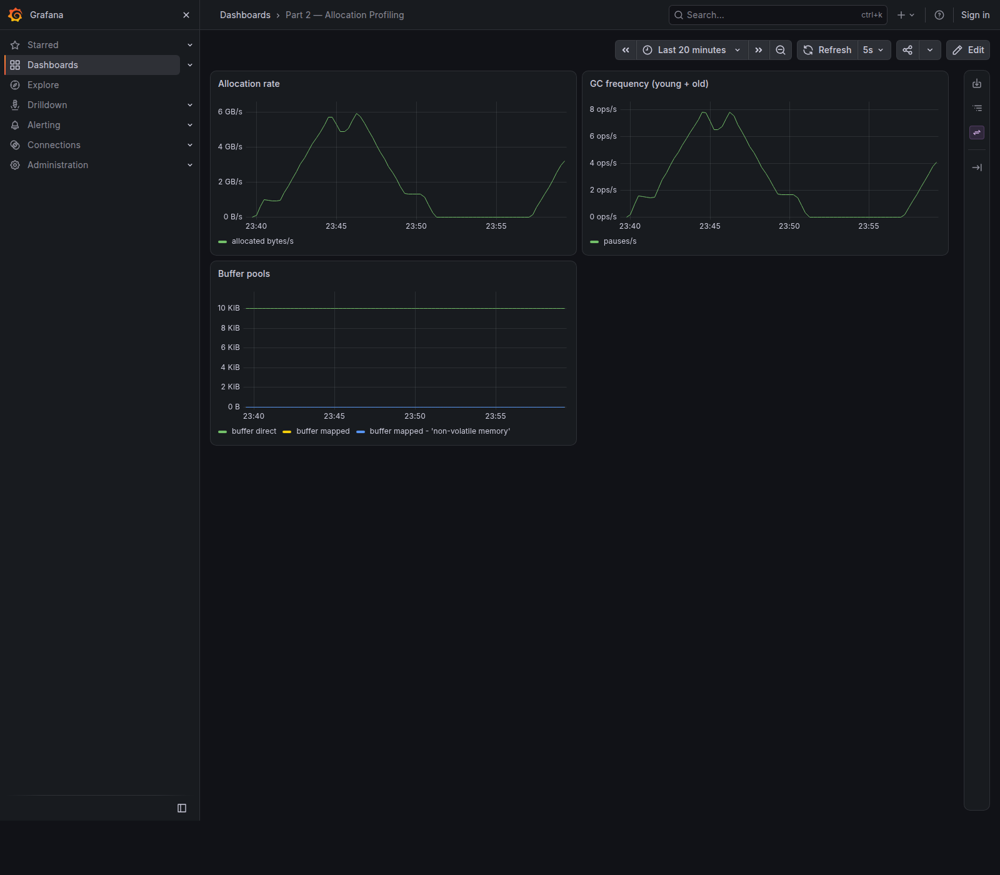

# JVM Incident Investigation: Part 2 — Allocation Profiling

Темп аллокаций в Grafana ушёл с нуля на **~12.5 ГБ/с**, а частота молодого GC — с нуля до **~16 сборок в секунду**. Что дальше — снимать heap dump? По алгоритму из Part 0 — нет: сначала симптом, потом вопрос, потом инструмент. А инструмент подберём после того, как поймём, что именно происходит с памятью.

У нас есть демо-приложение с «красной кнопкой»: ручка, которая включает поток массовых аллокаций. Пройдём весь путь от симптома до первопричины, с реальными командами и реальными метриками.

## Симптом: темп аллокаций улетел

Включаем проблему одной командой:

```bash
scripts/incidents.sh start allocation
```

Ответ:

```json
{ "type": "allocation", "status": "active", "description": "проблема активирована" }
```

Открываем Grafana, дашборд **Part 2 — Allocation Profiling**.

До запуска `rate(jvm_gc_memory_allocated_bytes_total[5m])` был практически **нулевым** — приложение в покое почти не аллоцирует, и до молодого GC дело просто не доходит. Через несколько секунд после `start` метрика пошла вверх.

Здесь важна деталь: дашборд строится с окном `[5m]`, поэтому после нажатия кнопки значение растёт не мгновенно, а «раскочегаривается» по мере того, как активный период заполняет пятиминутное окно.

Мгновенный темп удобнее мерить `irate(...[30s])` (сразу байты/с) или дельтой счётчика `increase(...[30s])`, разделив результат на 30 секунд: там картина сразу жёсткая — **~12.5 ГБ/с** аллокаций и **~16 молодых GC в секунду**.

На сглаженном `rate(...[5m])` через минуту после старта видно ~6 ГБ/с — и оно продолжает расти к плато. Важен не абсолют в конкретную секунду, а форма: метрика ушла с нуля и держится на уровне, на порядки превышающем baseline.

Заодно смотрим на частоту GC: `sum(rate(jvm_gc_pause_seconds_count[5m]))` тоже уходит вверх. Это ключевая связка: **массовые короткоживущие аллокации провоцируют молодой GC**. Объект родился — и почти сразу стал мусором.

## Дашборд: Part 2 — Allocation Profiling

Прежде чем идти дальше — зафиксируем карту наблюдения. Вот что на борде и что мы хотим увидеть при инциденте:

| Панель | Метрика | Что показывает | Что ждём при инциденте |
|---|---|---|---|
| Allocation rate | `sum(rate(jvm_gc_memory_allocated_bytes_total[5m]))` | темп аллокаций, байт/с | растёт с ~0 до гигабайтов в секунду |
| GC frequency (young + old) | `sum(rate(jvm_gc_pause_seconds_count[5m]))` | частота GC-пауз | растёт с ~0 до десятков пауз в секунду |
| Buffer pools | `jvm_buffer_memory_used_bytes` | буферные пулы NIO (direct/mapped) | почти не меняется — симптом не в NIO-буферах |

Про источник метрики. `jvm_gc_memory_allocated_bytes_total` — это счётчик Micrometer, который растёт на прирост молодого поколения между сборками: по сути, это аппроксимация «сколько байт приложение нааллоцировало». `rate(...)` превращает накопительный счётчик в байты в секунду. А `jvm_gc_pause_seconds_count` — счётчик GC-пауз; его `rate` даёт частоту сборок. Две панели вместе рассказывают одну историю: быстро аллоцируем → молодой GC молотит.

Третья панель — буферные пулы — стоит на борде как «контрольная»: если бы темп аллокаций рос, а GC-частота нет, можно было бы подозревать прямой `ByteBuffer.allocateDirect`. У нас буферы стоят на месте — значит, аллоцирует обычная куча.

Вот как это выглядит на живом дашборде — полный цикл инцидента: baseline → резкий рост → плато → возврат к baseline:



## Вопрос

Формулируем вопрос по методике из Part 0. Симптом — «высокий темп аллокаций». Вопрос — **«какой код создаёт объекты?»**.

И вот здесь главный соблазн — сразу снять heap dump. Ошибка. Heap dump показывает **содержимое** кучи: кто на кого ссылается, что удерживается. А у нас объекты не удерживаются — они живут миллисекунды и умирают в молодом поколении. Heap dump в лучшем случае покажет пустую молодёжь, в худшем — отвлечёт на несуществующую «утечку».

Разница принципиальная:

- **Memory leak** — объекты создаются, не собираются, куча растёт. Инструмент: heap dump + MAT (путь до GC root).
- **Allocation churn** — объекты создаются и сразу умирают, куча стабильна, но GC молотит. Инструмент: allocation-профилировщик.

У нас вторая ситуация. Значит, нужен инструмент, который отвечает не «что живо», а «где аллоцируется».

## Диагностика 1: async-profiler (режим alloc)

В Part 1 мы гоняли async-profiler в CPU-режиме (`asprof` без `-e`). Теперь включаем режим `alloc`: он сэмплирует события аллокаций и рисует flame graph по местам создания объектов.

Сразу оговорка про цену: alloc-режим дороже CPU-режима — он лезет в горячий путь аллокаций, поэтому overhead заметнее. На демо это неважно, на проде — снимаем короткий профиль и только после того, как метрики подтвердили проблему.

async-profiler лежит в образе (`/opt/async-profiler`). Снимаем 30 секунд:

```bash
docker exec app /opt/async-profiler/bin/asprof -d 30 -e alloc -f /artifacts/alloc.html 1
```

Открываем `artifacts/alloc.html` — это flame graph по аллокациям. Ось X — доля аллоцированных байтов, ось Y — стек. Наверху — одна гигантская рамка `byte[]`, и весь путь под ней ведёт в наш код. Если вытащить те же данные текстом:

```text
--- 455849196455 bytes (99.99%), 869465 samples
  [ 0] byte[]
  [ 1] com.hydroyura.article.jvmincidents.incident.allocation.AllocationIncident.lambda$doStart$0
  [ 2] AllocationIncident$$Lambda...run
  [ 3] java.lang.Thread.runWith
  [ 4] java.lang.Thread.run
```

**99.99%** всех аллокаций — это `byte[]`, создаваемый в `AllocationIncident.lambda$doStart$0`. Остальное (сотые доли процента) — шум: Prometheus-scrape, JMX-уведомления о GC, cgroup-метрики.

> Абсолютные байты в alloc-режиме стоит читать с оговоркой: async-profiler считает аллокации с гранулярностью TLAB (Thread-Local Allocation Buffer), а не отдельного объекта. Поэтому «455 ГБ за 30 секунд» — это оценка объёма, а не точный подсчёт; надёжный темп мы уже знаем из Prometheus (~12.5 ГБ/с). Для диагностики важна не цифра, а **доля и стек**: 99.99% указывает на одно место.

## Диагностика 2: JFR (allocation events)

async-profiler показал *где*, но подтвердим независимым источником. JFR — это встроенный в JVM event-based рекордер с почти нулевым оверхедом, и для аллокаций у него есть готовые события. `allocation-by-site` строится по событиям аллокаций; в стандартном профиле JDK используется сэмплирующее событие `jdk.ObjectAllocationSample` (аллокации сэмплируются с определённым весом, а не считаются пообъектно). Снимем запись с профилем `profile`:

```bash
docker exec app jcmd 1 JFR.start duration=60s filename=/artifacts/alloc.jfr settings=profile
```

«Независимость» JFR — это независимость *механизма сбора* (события аллокаций JVM против сэмплирования аллокаций в async-profiler), а не пообъектная точность: оба подхода сэмплируют, поэтому важна доля и стек, а не абсолютные байты. И важно, что 99.99% сходится из двух разных источников.

Смотрим распределение аллокаций по месту и по классу прямо из терминала:

```bash
docker exec app jfr view allocation-by-site /artifacts/alloc.jfr
docker exec app jfr view allocation-by-class /artifacts/alloc.jfr
```

```text
                       Allocation by Site

Method                                                         Allocation Pressure
-------------------------------------------------------------- -------------------
AllocationIncident.lambda$doStart$0()                                      99.99%
...остальное (JMX, Prometheus scrape, classfile)                           0.00%
```

```text
                       Allocation by Class

Object Type                                          Allocation Pressure
----------------------------------------------------- -------------------
byte[]                                                             99.99%
int[]                                                               0.00%
...остальное                                                        0.00%
```

Тот же результат из независимого источника: `byte[]` в `lambda$doStart$0`. Заодно глянем, как при этом ведёт себя GC:

```bash
docker exec app jfr view gc /artifacts/alloc.jfr
```

```text
Start    GC ID Type                   Heap Before GC Heap After GC Longest Pause
-------- ----- ---------------------- -------------- ------------- -------------
23:42:58 1,493 Young Garbage Collection     770.4 MB       27.3 MB       1.29 ms
23:42:58 1,494 Young Garbage Collection     771.3 MB       27.3 MB       1.23 ms
23:42:59 1,495 Young Garbage Collection     771.3 MB       27.2 MB       1.23 ms
...
```

Картина складывается полностью: молодое поколение наполняется до ~770 МБ и за ~1 мс собирается обратно до ~27 МБ — и так много раз в секунду. Объекты не доживают до old gen, куча в целом стабильна, но сборщик работает непрерывно.

## Первопричина

Все три инструмента указывают в одно место. Первопричина — **allocation churn**: массовое создание мелких короткоживущих объектов в горячем цикле:

```java
while (running.get()) {
    for (int i = 0; i < 1_000; i++) {
        byte[] buf = new byte[1024]; // 1 KB, живёт недолго
        buf[0] = (byte) i;
        sink = buf;
    }
}
```

Поток `allocation-churner` в бесконечном цикле аллоцирует по тысяче `byte[1024]` за итерацию и держит ссылку только на последний буфер (`sink`). Остальные 999 буферов становятся мусором сразу после создания. Отсюда и симптомы: темп аллокаций гигантский, молодой GC молотит, но куча не растёт — расти нечему.

Отдельный вопрос, который задаст внимательный читатель: почему JIT не устранил эти «мёртвые» аллокации через escape analysis? Две причины. `sink` объявлен `volatile`, и запись в него не даёт JIT полностью выкинуть аллокации; плюс HotSpot почти не скаляризует массивы — `byte[]` всё равно уходит в кучу. Поэтому ~12.5 ГБ/с — это настоящие аллокации, а не артефакт оптимизатора.

В реальном приложении это могло быть что угодно: конкатенация строк в цикле, сериализация/десериализация на каждый вызов, `new` в горячем пути, бокс примитивов, временные коллекции. Суть одна — **создаём больше, чем нужно, и быстрее, чем может выдержать GC**.

## Фикс и проверка

Выключаем проблему:

```bash
scripts/incidents.sh fix allocation
scripts/incidents.sh stop allocation
```

Здесь `fix` уже останавливает churn-поток, а `stop` возвращает состояние инцидента в `idle` — две команды идут парой, чтобы пройти полный цикл state-machine демо.

Возвращаемся в Grafana. Счётчик `jvm_gc_memory_allocated_bytes_total` перестаёт расти **сразу** — поток остановлен, аллокаций больше нет. А вот `rate(...[5m])` возвращается к нулю с задержкой: пятиминутное окно ещё какое-то время «помнит» активный период. Через пять минут график снова на нуле. Проверка пройдена: темп аллокаций и частота GC вернулись к baseline.

В реальном коде «фикс» — это не остановка потока, а устранение источника churn. Конкретика зависит от случая: конкатенация строк в цикле → `StringBuilder`; сериализация на каждый вызов → кеш или переиспользуемый буфер; `new byte[N]` в горячем пути → пул буферов или вынос аллокации из цикла. Общий принцип один — **создавать меньше и реже**. Демо-ручка `fix` показывает первый шаг: убрать нагрузку, а потом уже чинить причину.

## Что мы сделали

Полный алгоритм из Part 0 на конкретном инциденте:

```
симптом (темп аллокаций вырос в Grafana)
→ вопрос (какой код создаёт объекты?)
→ async-profiler alloc (где аллокации) — flame graph
→ JFR (подтверждение + контекст GC во времени)
→ первопричина (allocation churn)
→ fix + проверка (метрики вернулись)
```

Ключевой урок этой части: **allocation churn — это не memory leak**. Симптомы похожи (метрики лезут вверх), но вопрос и инструмент — разные. Прежде чем снимать heap dump, спросите себя: куча растёт или просто GC молотит? Если куча стабильна, а темп аллокаций и частота GC высокие — вам нужен allocation-профилировщик, а не MAT.

## Что дальше

В Part 3 возьмём следующий симптом — **частые и/или долгие GC-паузы**. Там вопрос будет не «где аллоцируется», а «почему GC работает именно так и какая фаза тормозит», и на сцену выйдут GC-логи и JFR. Увидимся.
