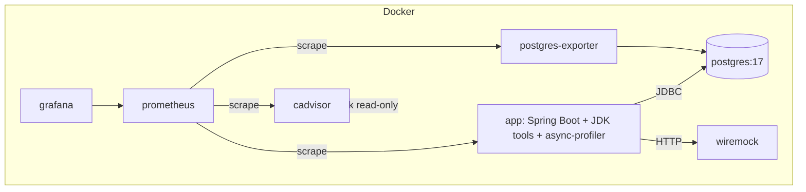

# Тестовый стенд — дизайн

Стенд для серии «JVM Incident Investigation»: воспроизводимые инциденты в демо-приложении, обсервабилити-стек и инструменты расследования. Поднимается одной командой `docker compose up`.

## 1. Концепция

- Демо-приложение Spring Boot с REST-ручками, которые «включают» конкретный инцидент.
- Обсервабилити: Micrometer → Prometheus → Grafana; контейнерные метрики через cAdvisor; статистика БД через postgres-exporter.
- WireMock — управляемый по REST «внешний сервис» для инцидентов с медленным I/O.
- Артефакты расследования (GC-логи, heap dump, JFR, NMT) складываются в общий volume и анализируются на хосте (JMC/MAT).
- Полный флоу каждого инцидента: **Trigger → Observe → Evidence → Root cause → Fix → Verify**.

## 2. Топология



| Сервис | Образ | Роль | Зависимости |
|---|---|---|---|
| `app` | свой Dockerfile (JDK 25 + async-profiler) | демо-приложение, ручки инцидентов | ждёт healthcheck `postgres` |
| `postgres` | postgres:17 | БД, `pg_stat_statements` | — |
| `postgres-exporter` | prometheuscommunity/postgres-exporter | статистика PostgreSQL → Prometheus | `postgres` |
| `prometheus` | prom/prometheus | сбор метрик | `app`, `postgres-exporter`, `cadvisor` |
| `grafana` | grafana/grafana | дашборды (provisioned) | `prometheus` |
| `cadvisor` | gcr.io/cadvisor/cadvisor | контейнерные метрики CPU/RSS | docker.socket (read-only) |
| `wiremock` | wiremock/wiremock:3 | mock внешнего сервиса, настройка по REST | — |

Все сервисы — в одной docker-сети. Порты наружу: `app:8080`, `prometheus:9090`, `grafana:3000`, `wiremock:8082` (отладка), `postgres:5432` (отладка).

## 3. Образ приложения

- **Полный JDK 25** (не JRE) — нужны `jcmd`, `jstack`, `jmap`.
- **async-profiler** установлен в образ. Для работы в Docker: `cap_add: [SYS_PTRACE, SYS_ADMIN]`. Если хост блокирует perf-события — фолбэк на JFR (работает без capabilities).
- JVM-флаги (baseline):
  - `-Xlog:gc*:file=/artifacts/gc.log:time,uptime,level,tags` — GC-логи (Part 3)
  - `-XX:NativeMemoryTracking=summary` — NMT (Part 5)
  - `-XX:+HeapDumpOnOutOfMemoryError -XX:HeapDumpPath=/artifacts` (Part 4)
  - JFR — запускается по требованию: `jcmd <pid> JFR.start duration=60s filename=/artifacts/recording.jfr`
- Actuator + Micrometer Prometheus:

```yaml
management:
  endpoints:
    web:
      exposure:
        include: health,info,metrics,prometheus
```

## 4. Обсервабилити (pull-модель)

Prometheus сам «вытягивает» метрики: приложение держит `/actuator/prometheus`, cAdvisor и postgres-exporter — свои `/metrics`.

```yaml
# infra/prometheus/prometheus.yml
scrape_configs:
  - job_name: 'spring-app'
    metrics_path: '/actuator/prometheus'
    scrape_interval: 15s
    static_configs:
      - targets: ['app:8080']

  - job_name: 'postgres-exporter'
    scrape_interval: 15s
    static_configs:
      - targets: ['postgres-exporter:9187']

  - job_name: 'cadvisor'
    scrape_interval: 15s
    static_configs:
      - targets: ['cadvisor:8081']
```

Дашборды Grafana (provisioned):

| Дашборд | Что показывает | Источник |
|---|---|---|
| **JVM Overview** | heap, GC, threads, process CPU | Micrometer (app) |
| **Container Resources** | CPU/RSS контейнеров | cAdvisor |
| **Database & Pool** | HikariCP + PostgreSQL | app + postgres-exporter |
| **Incident Workbench** | сводный взгляд на симптом во время инцидента | всё вместе |

## 5. Контракт ручек инцидентов

```
GET  /incidents                    — список типов + статусы
POST /incidents/{type}/start       — активировать проблему
POST /incidents/{type}/fix         — применить демо-фикс (переключить на корректный код)
POST /incidents/{type}/stop        — деактивировать/сбросить
GET  /incidents/{type}/status      — статус
```

`type ∈ {cpu, allocation, gc, memory-leak, native-memory, deadlock, threads, blocking-io, db-pool}`

## 6. Флоу по каждому инциденту

Единый цикл: **Trigger → Observe → Evidence → Root cause → Fix → Verify**.

### 6.1 `cpu` — High CPU

- **Триггер**: busy-loop фоновые потоки.
- **Симптом**: container CPU ~100%, latency растёт.
- **Доказательства**: async-profiler (cpu), JFR (hot methods), jstack.
- **Root cause**: горячий метод (бесконечный цикл / тяжёлый алгоритм).
- **Фикс**: исправить алгоритм.
- **Сброс**: остановить потоки.
- **Проверка**: CPU возвращается к baseline.

### 6.2 `allocation` — Allocation Churn

- **Триггер**: поток аллоцирует много короткоживущих объектов.
- **Симптом**: allocation rate↑, young GC учащается.
- **Доказательства**: async-profiler (alloc), JFR (allocation events).
- **Root cause**: горячие точки аллокаций.
- **Фикс**: StringBuilder / переиспользование / пулы.
- **Сброс**: остановить поток.
- **Проверка**: allocation rate → baseline.

### 6.3 `gc` — GC Profiling

- **Триггер**: два режима — частый young GC (allocation pressure) / крупные объекты (длинные паузы).
- **Симптом**: GC count↑, pauses↑.
- **Доказательства**: GC-логи (`/artifacts/gc.log`), JFR (GC events), `jcmd GC.heap_info`.
- **Root cause**: темп аллокаций / размер объектов / неверный размер кучи.
- **Фикс**: тюнинг кучи, снижение аллокаций.
- **Сброс**: остановить нагрузку.
- **Проверка**: GC-метрики → baseline.

### 6.4 `memory-leak` — Heap Dump & Memory Leaks

- **Триггер**: static-коллекция растёт (объекты не удаляются).
- **Симптом**: heap↑, GC thrash, near-OOM.
- **Доказательства**: heap dump (`jcmd GC.heap_dump`) + MAT.
- **Root cause**: удерживающая ссылка.
- **Фикс**: bounded cache / weak refs.
- **Сброс**: очистить коллекцию или restart.
- **Проверка**: heap стабилен после Full GC.

### 6.5 `native-memory` — Native Memory

- **Триггер**: direct ByteBuffers не освобождаются.
- **Симптом**: RSS↑, heap в норме.
- **Доказательства**: NMT (`jcmd VM.native_memory summary`), cAdvisor RSS.
- **Root cause**: direct buffers / metaspace / threads.
- **Фикс**: корректное освобождение, `-XX:MaxDirectMemorySize`.
- **Сброс**: освободить буферы или restart.
- **Проверка**: RSS стабилен.

### 6.6 `deadlock` — Deadlock

- **Триггер**: два потока захватывают два лока в обратном порядке.
- **Симптом**: запросы виснут, blocked threads.
- **Доказательства**: jstack (`found deadlock`), JFR (lock events).
- **Root cause**: неверный порядок блокировок.
- **Фикс**: lock ordering (единый порядок).
- **Сброс**: restart (deadlock не снимается без перезапуска).
- **Проверка**: потоки разблокированы.

### 6.7 `threads` — Threads & Locks

- **Триггер**: неограниченное создание потоков.
- **Симптом**: thread count↑, `unable to create native thread`.
- **Доказательства**: jstack, JFR, Micrometer thread metrics.
- **Root cause**: нет пула / утечка потоков.
- **Фикс**: ExecutorService с фиксированным пулом.
- **Сброс**: прервать потоки.
- **Проверка**: thread count → baseline.

### 6.8 `blocking-io` — Blocking & I/O

- **Триггер**: WireMock переводится на задержку (REST), приложение делает блокирующие вызовы.
- **Симптом**: latency↑, Tomcat thread pool насыщен, потоки в `WAITING`.
- **Доказательства**: JFR (socket I/O), thread dump, Micrometer timers.
- **Root cause**: блокирующий I/O + ограниченный пул.
- **Фикс**: таймауты / async / circuit breaker.
- **Сброс**: WireMock в «быстрый» режим + stop.
- **Проверка**: latency/threads → baseline.

### 6.9 `db-pool` — Connection Pool Exhaustion

- **Триггер**: соединения берутся и не возвращаются в пул.
- **Симптом**: HikariCP active=max, pending↑, таймауты.
- **Доказательства**: HikariCP metrics, `pg_stat_activity`, postgres-exporter.
- **Root cause**: утечка соединений.
- **Фикс**: try-with-resources, размер пула, таймауты.
- **Сброс**: вернуть соединения.
- **Проверка**: pending=0, latency → baseline.

## 7. WireMock (Part 7)

- Приложение ходит в WireMock как во «внешний API»: `http://wiremock:8080/api/...`.
- Настройка через admin API `POST http://wiremock:8080/__admin/mappings`:

```json
{ "request":  { "method": "GET", "url": "/api/slow" },
  "response": { "status": 200, "fixedDelayMilliseconds": 5000,
                "jsonBody": { "ok": true } } }
```

- Обрывы: `"response": { "fault": "CONNECTION_RESET_BY_PEER" }`.
- Ручка `POST /incidents/blocking-io/start` сама настраивает WireMock (REST) и начинает блокирующие вызовы.

## 8. Артефакты расследования

- `./artifacts` → `/artifacts` в контейнере `app`.
- Туда попадают: GC-логи, heap dump, JFR-записи, NMT-отчёты.
- Анализ на хосте: JMC (JFR), MAT (heap dump). `artifacts/` — в `.gitignore`.

## 9. Структура файлов

```
infra/
  docker-compose.yml
  app/Dockerfile
  prometheus/prometheus.yml
  grafana/provisioning/
    datasources/prometheus.yml
    dashboards/…
  postgres/init.sql          # schema + pg_stat_statements
artifacts/                   # gitignored — вывод расследования
```

## 10. TODO

> **Проверить в конце реализации**: нужны ли `/fix`-ручки (показывают «до/после» в живом приложении) или фикс достаточно показать кодом в статье. Решение с обоснованием зафиксировать здесь.
